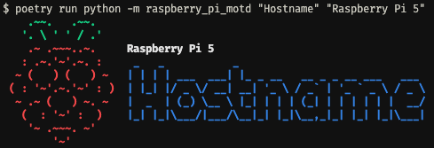

# Raspberry Pi MOTD Generator

Prints the specified hostname and model name along with the Raspberry Pi logo.

To run:

```bash
poetry install
poetry run python -m raspberry_pi_motd "Hostname" "Raspberry Pi 5"
```

This will print:

```
    .~~.   .~~.
   '. \ ' ' / .'
    .~ .~~~..~.     Raspberry Pi 5
   : .~.'~'.~. :     _   _           _
  ~ (   ) (   ) ~   | | | | ___  ___| |_ _ __   __ _ _ __ ___   ___
 ( : '~'.~.'~' : )  | |_| |/ _ \/ __| __| '_ \ / _` | '_ ` _ \ / _ \
  ~ .~ (   ) ~. ~   |  _  | (_) \__ \ |_| | | | (_| | | | | | |  __/
   (  : '~' :  )    |_| |_|\___/|___/\__|_| |_|\__,_|_| |_| |_|\___|
    '~ .~~~. ~'
        '~'
```

The output includes ANSI colors, so when you run the command it will look like this:



On a Raspberry Pi, you can run this to set the output to be the first thing you see upon login in the terminal:

```bash
poetry run python -m raspberry_pi_motd "Hostname" "Raspberry Pi 5" -o motd
sudo mv motd /etc/motd
```
